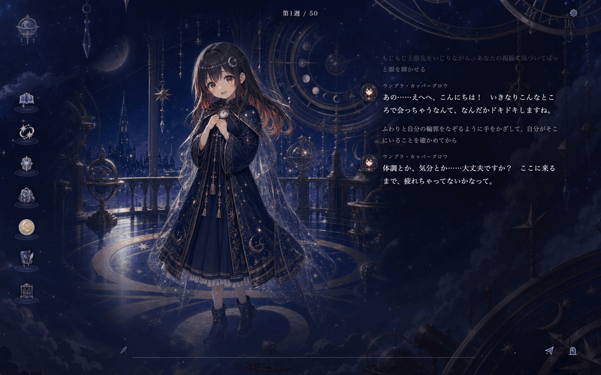
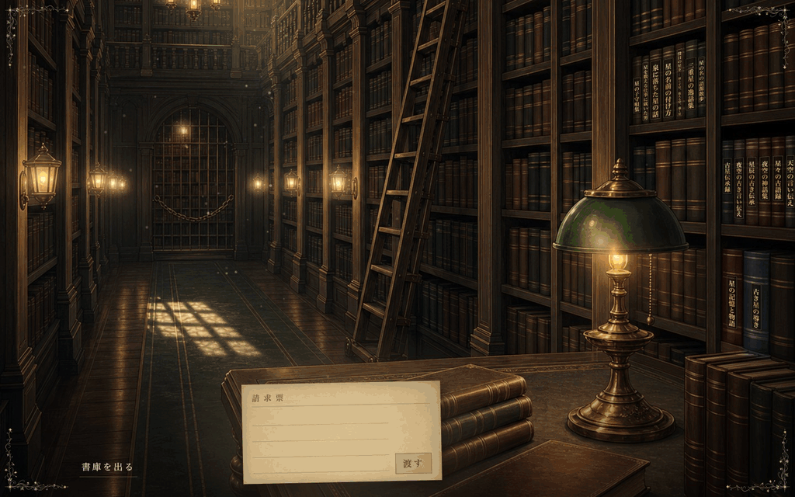

# STARFALL MAGIC ACADEMY

This game is playable in Japanese only, and this document is written in Japanese.
このゲームは日本語専用です。


星灯魔法学院は、魔力の流れが地脈として集まる丘の上に建つ全寮制の魔法学院で、プレイヤーはそこに通う生徒のひとりとして、五十週を過ごします。学院に暮らす百七十人あまりの生徒と先生にはそれぞれの人柄と話し方があり、その台詞は手元で動かす LLM がその場で書くので、決められた選択肢を選ぶ代わりに、話したいことを自分の言葉で打ち込めば、相手はその人らしく応えます。交わした言葉は相手の記憶として残り、次に会ったときの話に混ざって気持ちも少しずつ動いていくので、同じ相手とでも、遊ぶ人ごとに違う関係が育っていきます。

週のはじまりには、学院の外にある月夜の空間で案内人の少女と話しながら、その週をどこで過ごすかを決めます。案内人は十人いて、新しく始めるたびにそのうちのひとりが選ばれます。



行き先には、生徒と出会って話す学院の中の場所のほかに、ダンジョンの探索や調合、宵の競売、気分を言葉で伝えると楽師が一曲作ってくれる奏楽堂、棚から手に取った本の中身を、多くはその場で LLM が書き起こす大書庫のような場が並んでいます。



## 遊ぶのに要るもの

生徒の台詞は会話のたびに LLM が書くので、遊ぶには手元で LLM を動かす環境が要ります。

- git
- Node.js と npm（確かめた環境は Node.js v24 です）
- LM Studio（同じ PC で動かしても、同じローカルネットワークにある別のマシンで動かしてもかまいません）
- Gemma 4 31B を動かせる GPU（下の「LM Studio の設定」は VRAM 24GB の GPU での例です）

LM Studio とつながっていなくてもタイトル画面と設定画面までは開けますが、生徒との会話をはじめ、ゲームを先へ進めるには LM Studio が要ります。

## 起動まで

1. リポを取ってきて、その中へ移ります。

   ```bash
   git clone https://github.com/uyuris/starfall-magic-academy.git
   cd starfall-magic-academy
   ```

2. 必要なパッケージを入れます。

   ```bash
   npm install
   ```

3. ゲームのサーバーを起動します。

   ```bash
   npm start
   ```

   `STARFALL MAGIC ACADEMY runtime listening on http://127.0.0.1:4173` と出れば起動しています。LM Studio の設定がまだ無いうちは、続けて `LM Studio config not found` で始まる一行が出ますが、そのまま進めてかまいません。

4. ブラウザで `http://127.0.0.1:4173/` を開くと、タイトル画面が出ます。ポートと待ち受けのアドレスは、環境変数の `PORT` と `HOST` で変えられます。

サーバーを止めるときは、起動した端末で Ctrl+C を押します。

## LM Studio とつなぐ

まず LM Studio の側で、遊ぶモデルを読み込み、Local Server（OpenAI 互換の API）を起動しておきます。モデルと設定は、下の「LM Studio の設定」にあります。

つぎにゲームの側で、タイトル画面の「設定」を押します。設定画面は「接続設定」が開いた状態で出るので、ここで LM Studio の居場所を伝えます。

1. 「接続先ホスト」に、LM Studio が動いているマシンのアドレスを入れます。同じ PC で動かしているなら `127.0.0.1`、同じローカルネットワークの別のマシンで動かしているなら、そのマシンの LAN 内の IP アドレス（`192.168.x.x` のような形）です。
2. 「ポート」に、LM Studio の Local Server のポートを入れます。LM Studio の既定は `1234` です。
3. 「モデル一覧を取得」を押します。LM Studio につながれば、「モデル」の欄に LM Studio にあるモデルの名前が並びます。
4. 「モデル」で遊ぶモデルを選びます。「シンキングエフォート」も、ここで None・Low・Medium・High から選べます。

この画面に保存のボタンはありません。モデルを選ぶと、そのときのホストとポートと合わせてその場で反映され、画面に「反映しました」と出ます。そのあとは、ホストとポートは入力を確定したとき（Enter を押すか、ほかの欄へ移ったとき）に、モデルとシンキングエフォートは選んだときに反映されます。設定は `app/config/lmstudio.json` に書かれ、次に起動したときもそのまま使われます（設定例は `app/config/lmstudio.example.json`）。

## 最初の会話まで

タイトル画面に戻って「最初から始める」を押すと、月夜の空間で案内人との会話が始まります。話したいことを自分の言葉で入力欄に打ち込めば、その人らしい返事が返ってきて、話しているうちに、その週をどこで過ごすかが決まります。

続きから遊ぶときは、タイトル画面の「ロード」でセーブを選びます。要らなくなったセーブは、そこで消すこともできます。

## LM Studio の設定

このゲームは Gemma 4 31B を前提に作っています。31B のモデルを長いコンテキストで動かすので、4bit 程度まで量子化しないと手元の GPU では動かすのが厳しくなります。VRAM 24GB の GPU での設定の例は次のとおりで、会話の長さを保ちながら 24GB に収めるために、KV キャッシュも量子化しています。

| 項目 | 設定 |
|---|---|
| モデル | Gemma 4 31B の QAT 版（LM Studio の一覧での名前は `google/gemma-4-31b-qat`） |
| コンテキストサイズ | `48000` |
| MTP | 有効（デコーディング用に Q4 のモデルを使う） |
| 評価バッチサイズ | `2048` |
| KV Cache Quantization | 4bit |
| Max Concurrent Predictions | `1` |
| Unified KV Cache | 無効 |
| API | Local Server（OpenAI 互換の API） |

これは 24GB に収めるための設定なので、VRAM にもっと余裕があれば、ここまで切り詰めなくてよいはずです。とくに KV キャッシュの量子化は使わないほうが性能の面で有利とされていて、Max Concurrent Predictions や Unified KV Cache も緩められるかもしれません。ただ、24GB より大きい環境での設定は確かめていません。

## 困ったとき

### 会話が始まらない、途中で止まる

LM Studio とうまくつながっていないことが多いので、次を確かめてください。

- LM Studio の Local Server が起動しているか。
- 設定画面の接続先ホストとポートが合っているか。別のマシンの LM Studio につなぐときは、`127.0.0.1` ではなくそのマシンの LAN 内の IP アドレスになっているか。
- 「モデル一覧を取得」でモデルの名前が並ぶか。
- 「モデル」で、LM Studio に読み込んであるモデルを選んでいるか。
- LM Studio の側で、モデルの読み込みが終わっているか。
- VRAM が足りなくなっていないか。

### モデルが読み込めない、返事がとても遅い

VRAM の量と、LM Studio の量子化やコンテキストの設定が合っていないことが考えられます。VRAM 24GB の環境なら、上の「LM Studio の設定」の表と、LM Studio の設定がひとつずつ一致しているかを確かめてください。

### LM Studio につながらない

- LM Studio で Local Server（OpenAI 互換の API）が有効になっているか。
- 同じ PC で動かしているなら、ブラウザで `http://127.0.0.1:1234/v1/models` を開いて応答が返るか（ポートを変えているなら、その番号で）。
- 別のマシンで動かしているなら、`http://<LAN内のIPアドレス>:1234/v1/models` を開いて応答が返るか。
- ファイアウォールやセキュリティソフトが、PC の中やローカルネットワークの中の通信を止めていないか。

## リポの中身

ゲームは Node.js のサーバーとブラウザの画面でできていて、同じゲームを Electron で包んだデスクトップ版の起動口（`npm run electron`）もあります。デスクトップ版のセーブは、OS のユーザーデータの場所に別に置かれます。

- `app/` — ゲームのサーバー、ブラウザの画面、設定、テスト
- `electron/` — デスクトップ版の入口
- `content/` — 生徒たちの人物像など、書かれた中身
- `data/definitions/` — ゲームと世界の定義
- `data/seeds/` — 新しく始めるときの初期データ
- `data/mutable/` — 遊んでいるあいだにできるセーブなど（git では追いません）
- `assets/` — 絵、BGM、アイコンと、素材の出所と扱いの説明
- `scripts/`・`tools/` — 起動や素材まわりの補助スクリプト

ブラウザで遊ぶときのセーブは `data/mutable/` に置かれ、その置き場を複数のサーバーで同時に書き換えないよう、ひとつのリポで同時に起こせるサーバーはひとつだけです。

手を入れたあとの確認には、次を使います。

```bash
npm run check   # 構文の確認
npm test        # テスト
node scripts/smoke.mjs   # サーバーが起動して GET / が 200 を返すかの確認（LM Studio なしで通ります）
```

## 素材とライセンス

このゲームの絵と BGM は生成 AI で作ったものです。リポが公開されていても、絵・BGM・キャラクターの素材を使ってよいという意味にはなりません。素材の出所と扱いは [assets/README.md](assets/README.md) にあります。

このリポにはオープンソースのライセンスを付けていません（UNLICENSED / All Rights Reserved）。読むことや話題にすることはかまいませんが、コードと素材の複製・再配布・改変したものの公開・再利用には、作者の許可が要ります。ライセンスの全文は [LICENSE](LICENSE) にあります。

ゲームはまだ作っている途中で、会話や表示に不安定なところが残っていることがあり、セーブデータの形式も今後変わることがあります。
